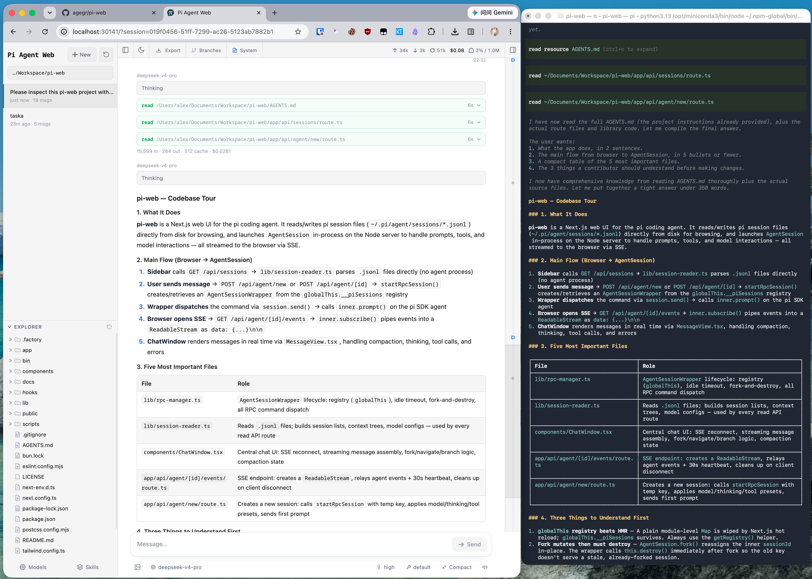

# Pi Web Plus

<p align="left">
  <picture>
    <source media="(prefers-color-scheme: dark)" srcset="./public/icons/pi-web-plus-logo-dark.svg" />
    <source media="(prefers-color-scheme: light)" srcset="./public/icons/pi-web-plus-logo-light.svg" />
    
  </picture>
</p>

> **品牌更新：** 当前 `main` 源码已包含 π+ SVG 品牌标识，历史 v1.1.0 发行包保持原样，不覆盖既有资产。

[English](./README.md) | [日本語](./README.ja.md) | [Русский](./README.ru.md)

面向 [pi 编程智能体](https://github.com/earendil-works/pi)（`@earendil-works/pi-coding-agent`）的独立增强版（**Pi Web Plus**，Standalone Edition）本地浏览器界面。Pi Web Plus 与 pi 共用本机配置和会话文件，可在浏览器中查找和继续对话、运行智能体、配置模型与资源，并查看项目文件。

> **说明**：外部上游静态演示站仅展示旧版上游基础界面，不代表 **Pi Web Plus**（独立发行版内置完整前端增强套件，并通过 [`koxircom/pi-web-plus`](https://github.com/koxircom/pi-web-plus) 独立发布）。



## 功能

- **会话工作区**：按项目查找、继续、重命名、导出和删除对话，并查看运行状态、上下文占用、花费和压缩信息。
- **两种分支方式**：**新会话**会从较早的消息创建独立会话文件；**从此处编辑**会在当前会话内创建分支。
- **项目文件工具**：浏览和上传文件、查看 Git Diff，并预览源码、Markdown、图片、音频、PDF 和 DOCX；文件变化后会自动刷新。
- **Git worktree**：从侧边栏切换 checkout，同时把同一仓库不同 worktree 的会话归在一起。
- **网页配置**：无需离开 Pi Web，即可管理 Provider 登录和 API Key、模型、模型测试、插件包及技能。
- **英文、简体中文和繁体中文界面**：Pi Web 首次打开时跟随浏览器语言，也可从顶部栏切换语言。
- **内置增强插件系统**：开箱即用的模块化前端增强套件，包含会话右键菜单、划词快捷工具栏、耗时拆解气泡、单步 Token/s 流速监控、左侧设置导航与自动折叠工具调用（详见 [增强插件文档](./enhancements/README.md)）。

## 快速开始

Pi Web Plus 要求 Node.js 22.19.0 或更高版本（`node >=22.19`）。先用 `node --version` 检查版本，然后从 [`koxircom/pi-web-plus` GitHub Releases](https://github.com/koxircom/pi-web-plus/releases) 全局安装官方预构建 `.tgz` 发行包并启动 `pi-web`：

```bash
npm install -g https://github.com/koxircom/pi-web-plus/releases/download/v1.1.0/pi-web-standalone-1.1.0.tgz
pi-web
```

> **重要说明**：内部 `package.json` 的包名仍保留为 `@agegr/pi-web` 以维持运行时兼容，但 Pi Web Plus 仅通过 [`koxircom/pi-web-plus` GitHub Releases](https://github.com/koxircom/pi-web-plus/releases) 的 `.tgz` 资产分发。**切勿从公共 npm 源拉取或安装 `@agegr/pi-web`**，否则会误装外部旧版上游包。

服务就绪后，命令行会尝试自动打开浏览器。如果没有打开，请访问 [http://127.0.0.1:30141](http://127.0.0.1:30141)。Pi Web 默认仅监听 `127.0.0.1`。

如果尚未配置模型 Provider，请打开**模型（Models）**面板登录或添加 API Key。

上例以 `v1.1.0` 标准资产（`pi-web-standalone-1.1.0.tgz`）为格式示例。安装指定版本或升级新版本时，请先用 `Ctrl+C` 停止正在运行的进程，将链接中的 `v1.1.0` 和 `1.1.0` 替换为 [GitHub Releases](https://github.com/koxircom/pi-web-plus/releases) 中对应的目标版本号 `<version>` 后重新执行安装命令：

```bash
npm install -g https://github.com/koxircom/pi-web-plus/releases/download/v<version>/pi-web-standalone-<version>.tgz
```

- **Web 依赖 SDK 与全局 CLI 边界**：Pi Web `v1.1.0` 的 Web 运行时依赖统一使用 `@earendil-works/pi-*` SDK `0.99.1`，安装或升级 Pi Web **不会**自动升级宿主机全局安装的 `pi` Agent CLI。
- **安装包不含 `node_modules`**：预构建 `.tgz` 发行包仅包含 `.next/` 与前端静态产物，不含 `node_modules/`，需通过常规 `npm install` 安装依赖（离线部署时需复用版本匹配的 `node_modules/`）。
- **保护自定义 manifest / 会话 / 账本**：升级或覆盖部署时，请注意保留实例自定义的 `public/pi-*-manifest.json`、本地会话目录（`~/.pi/agent/sessions/`）及用量账本（`pi-usage-ledger.json` / `~/.pi/agent/state/`），避免被包内默认空清单覆盖。

卸载时运行 `npm uninstall -g @agegr/pi-web`。

## 配置

端口和主机名以命令行参数为准，优先于对应的环境变量。`--no-open` 与 `PI_WEB_NO_OPEN=1` 中任意一个都会关闭自动打开浏览器。运行 `pi-web --help`（或 `-h`）可打印启动选项并以退出码 0 结束，不会启动服务；未知参数会报错并以退出码 1 结束。

| 参数或环境变量 | 用途 | 默认值 |
| --- | --- | --- |
| `--help`、`-h` | 打印启动选项并退出 | — |
| `--port <端口>`、`-p <端口>` 或 `PORT` | 服务端口 | `30141` |
| `--hostname <主机>`、`-H <主机>` 或 `PI_WEB_HOSTNAME` | 监听主机名 | `127.0.0.1` |
| `--no-open` 或 `PI_WEB_NO_OPEN=1` | 不自动打开浏览器 | 自动打开 |
| `PI_WEB_ALLOWED_HOSTS` | 额外允许的代理或自定义主机名，多个值用逗号分隔，必须精确匹配 | 未设置 |
| `PI_WEB_PASSWORD` | 启用浏览器密码登录；API 客户端可使用用户名为 `pi` 的 Basic Auth | 不启用认证 |

例如：

```bash
pi-web --help
pi-web -p 8080 -H 0.0.0.0 --no-open
```

### 远程访问

监听非回环地址会暴露一个可执行高权限操作的智能体。在可信局域网中使用时，请设置足够长的随机密码：

```bash
PI_WEB_PASSWORD='足够长的随机密码' pi-web --hostname 0.0.0.0
```

密码认证不会加密连接。不要通过明文 HTTP 将 Pi Web 暴露到互联网；远程访问应使用可信反向代理提供 HTTPS，或通过可信 VPN。如果反向代理传递外部主机名，请把该名称精确加入 `PI_WEB_ALLOWED_HOSTS`。这个白名单不会改变 Pi Web 的监听地址。

### HTTP 代理

服务端的模型和 API 请求会读取标准的 `HTTP_PROXY`、`HTTPS_PROXY` 和 `NO_PROXY` 环境变量。

macOS 或 Linux（通过 [GitHub Release `.tgz` 安装包](https://github.com/koxircom/pi-web-plus/releases/download/v1.1.0/pi-web-standalone-1.1.0.tgz)安装并启动）：

```bash
npm install -g https://github.com/koxircom/pi-web-plus/releases/download/v1.1.0/pi-web-standalone-1.1.0.tgz
HTTP_PROXY=http://127.0.0.1:7890 \
HTTPS_PROXY=http://127.0.0.1:7890 \
NO_PROXY=localhost,127.0.0.1 \
pi-web
```

Windows PowerShell：

```powershell
npm install -g https://github.com/koxircom/pi-web-plus/releases/download/v1.1.0/pi-web-standalone-1.1.0.tgz
$env:HTTP_PROXY = "http://127.0.0.1:7890"
$env:HTTPS_PROXY = "http://127.0.0.1:7890"
$env:NO_PROXY = "localhost,127.0.0.1"
pi-web
```

## 注意事项

- **智能体数据**：Pi Web 默认读取 `~/.pi/agent` 下的 pi 数据，包括 `sessions/<编码后的工作目录>/<时间戳>_<uuid>.jsonl` 中的会话文件。可通过 `PI_CODING_AGENT_DIR` 指定其他 pi agent 目录。
- **文件系统访问**：Pi Web 必须能读取智能体数据目录及会话记录中的工作目录。与现有 pi 会话共用数据时，请让 Pi Web 运行在与 pi 相同的文件系统环境中。
- **共享配置**：模型面板使用 pi 的模型、设置和凭据存储，因此两种界面都能看到相关更改。
- **文件访问边界**：文件浏览器仅能访问在 Pi Web 中选择过的工作目录，以及它已识别的项目或会话根目录；它不是通用的文件系统浏览器。
- **Git worktree**：切换器何时显示、如何创建 worktree，以及删除会产生什么影响，见 [Pi Web 里的 Worktree](./docs/worktrees.zh-CN.md)。

## 开发

```bash
npm install
npm run dev
```

开发服务器运行在 [http://127.0.0.1:30141](http://127.0.0.1:30141)。常用检查命令：

```bash
npm test
node_modules/.bin/tsc --noEmit
npm run lint
```

日常开发时不要运行 `next build` 或 `npm run build`。它们会写入 `.next/`，可能干扰开发服务器；仅在发布流程中执行构建。

贡献者文档：[国际化](./docs/i18n.md)和[发布流程](./docs/release.md)。

## 仓库结构

```text
app/             Next.js 界面和 API 路由
components/      React 界面组件
hooks/           客户端状态和交互 hooks
lib/             会话、智能体、模型、文件、Git 和安全逻辑
public/          静态资源和 PWA 文件
bin/             npm CLI 入口及启动参数解析
docs/            面向用户和贡献者的专题文档
demo/            发布到 GitHub Pages 的静态演示站（见 demo/README.md）
```

架构说明和详细文件地图见 [AGENTS.md](./AGENTS.md)。

## 许可证

[MIT](./LICENSE)
